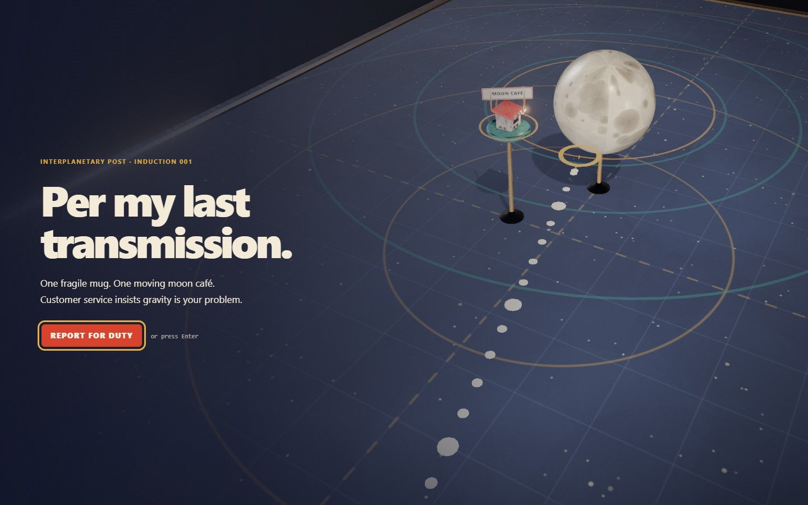
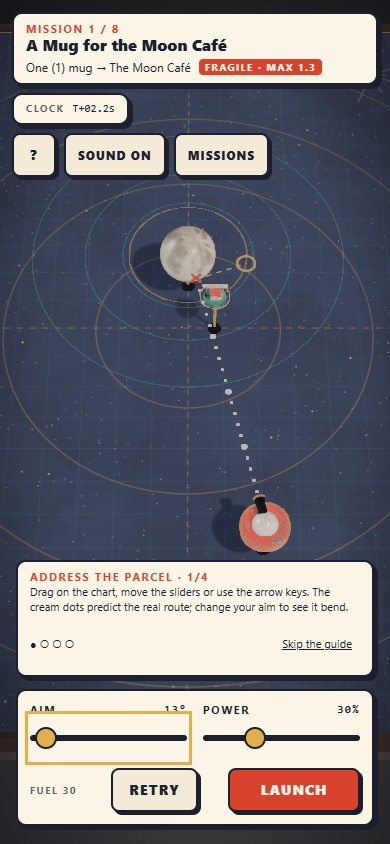
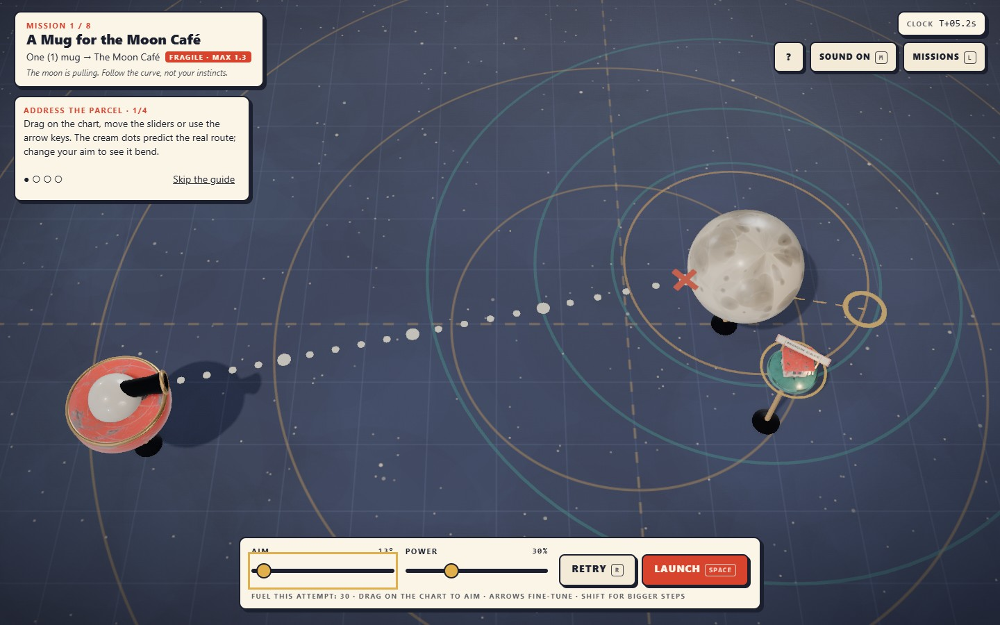

# PER MY LAST TRANSMISSION

<p align="center"></p>

An orbital parcel service with moving addresses and fragile contents. Aim a depot cannon, let gravity bend the flight and use one carefully timed brake to meet the receiving dock. The dotted route predicts the same physics that will carry your parcel.

**[Report for duty →](https://04-per-my-last-transmission.williamking.workers.dev)** · [Run locally](#run-locally) · [Credits](#credits)

<p align="center"></p>

## Your first delivery

Choose **Report for duty** or press Enter to leave the moving orrery title shot. The four-step guide waits for you to aim, launch, brake and arrive; it can be skipped or replayed from help. Reduced motion cuts the camera transition.

The dock keeps moving while you aim, so launch time matters as much as angle and power. A brass ghost previews what braking now would do. After a miss, the red dashed trace and closest-pass marker explain where the attempt went wrong.

| Action | Keyboard | Pointer or touch |
| --- | --- | --- |
| Aim / power | Arrows or WASD; Shift changes the aim step | Drag the chart; Power slider |
| Launch | Space or Enter | Launch |
| Brake once in flight | B or Space | Brake ×1 |
| Retry, including mid-flight | R | Retry |
| Advance after delivery | N or Enter | Next parcel |
| Open the mission list | L; Escape closes | Missions |
| Toggle sound | M | Sound |

## Eight parcels, different problems

The manifest introduces moving docks, debris, a second gravity well, a dock carried by a moon and ricochets. Fragile parcels punish hard impacts; robust parcels can bounce. Each mission awards Delivered, Gentle and Frugal stamps for arrival, a sufficiently soft landing and fuel discipline. Complete the manifest to reach the ending, then replay for a better set of stamps.

## Engineering details

- **Shared flight and prediction:** analytic orbits and a fixed 120 Hz simulation drive the actual parcel, route preview and brake ghost. Retry resets the simulation clock.
- **A physical miniature:** enamel surfaces, ceramic planets and brass supports sit under a shared environment light, contact shadows and restrained bloom.
- **Adaptive cost:** quality tiers and a frame governor lower expensive rendering work on slower graphics chips; prepared assets and the first successful draw gate the opening.
- **Reliable interaction:** keyboard and pointer ownership survive canceled drags, blur and dialogs. Mission and ending panels retain usable native focus, including compact touch layouts.

## Recorded release verification

Application revision `49d3b5e`: **107 tests / 1,654 assertions**, 200 independently checked timing variants and four RTX 2060 browser scenarios covering all eight deliveries, ending/replay and touch/input regressions. See the [bug-pass report](docs/visual/BUG-PASS-2026-09-30.md).

[src/game/](src/game/) owns flight and scoring; [src/scene/](src/scene/) draws the orrery; [src/ui/](src/ui/) owns controls; [src/audio/](src/audio/) owns sound. [scripts/solve.ts](scripts/solve.ts) searches launch and brake routes.

## Current screenshots

| Desktop | Phone |
| --- | --- |
|  |  |



The opening loop and three main screenshots were captured from the live site on **1 October 2026**, using Chrome on this workstation; the phone image is a 390 × 844 browser viewport. The animated preview is a short loop, not a full playthrough. [Capture details](docs/readme/capture.json).

## Run locally

Use **Bun 1.3.10** (the version pinned in `package.json`) and Node.js 22.12 or newer. From this repository:

```sh
bun install --frozen-lockfile
bun run dev      # http://127.0.0.1:4514/
bun run check    # strict types, Biome, unit tests and production build
bun run preview  # http://127.0.0.1:4614/ after the build
```

Development and preview are separate long-running commands; run one at a time or use separate terminals. `bun run build` writes the static production output to `dist/`. Dependencies and the lockfile are local to this project.

### Browser suite

Install the test browser once, then run the checked-in Playwright suite. Its configuration builds and starts the production preview. Browser scenarios are separate from `bun run check`.

```sh
bunx playwright install chromium
bun run test:e2e
```

The recorded real-GPU release checks used installed Chrome on an RTX 2060; the default Chromium configuration is not a claim of physical-phone coverage.

## Stack and release

Direct Three.js 0.186 · React 19.3 · strict TypeScript · Vite 8.3 · GSAP 3.15 · Tailwind CSS 4.3 · Bun 1.3.10 · Biome. The public website is served by Cloudflare Workers. This README describes [application revision 49d3b5e](https://github.com/WilliamHenryKing/04-per-my-last-transmission/commit/49d3b5e8f18f7012b12d9fad736497a00657ecd3); the documentation refresh changes no application behaviour.

## Credits

Geometry, the planet glazes, the printed star chart and the README art are made in code or hand-written SVG. Type uses the system font stack. Every shipped asset is listed with its source URL, author, licence, retrieval date, processing and sha256 in [`assets.manifest.json`](assets.manifest.json).

### Textures and lighting

| Asset | Used for | Source | Author | Licence |
| --- | --- | --- | --- | --- |
| Painted Metal 004 | Postal-red enamel: depot drum, dock awning | [Source](https://ambientcg.com/view?id=PaintedMetal004) | ambientCG | CC0 |
| Painted Metal 012 | Cream and teal enamel: café hut, dock pad | [Source](https://ambientcg.com/view?id=PaintedMetal012) | ambientCG | CC0 |
| Metal 027 | Powder-coated steel: cannon barrel, stand feet, crate | [Source](https://ambientcg.com/view?id=Metal027) | ambientCG | CC0 |
| Cardboard 001 | The battered parcel | [Source](https://ambientcg.com/view?id=Cardboard001) | ambientCG | CC0 |
| Kitchen Wood | Chart-table frame | [Source](https://polyhaven.com/a/kitchen_wood) | Poly Haven | CC0 |
| Rough Linen | Weave of the star-chart sheet | [Source](https://polyhaven.com/a/rough_linen) | Poly Haven | CC0 |
| Rock Face 03 | Debris boulders | [Source](https://polyhaven.com/a/rock_face_03) | Poly Haven | CC0 |
| Studio Small 09 (HDRI) | Image-based lighting and the blurred backdrop | [Source](https://polyhaven.com/a/studio_small_09) | Sergej Majboroda (Poly Haven) | CC0 |

The Poly Haven wood, linen and rock sets were copied from ODD TIDE, another project in the collection, with their records carried over. All textures ship as 1K (rock 512 px) WebP, with roughness and metalness packed into one map.

### Audio

All audio is in `public/audio/`, re-encoded to MP3 (about 2.5 MB in total). Every file is CC0 (public domain dedication: [CC0 licence](https://creativecommons.org/publicdomain/zero/1.0/)), so attribution is not required but is given here.

| File(s) | Source | Author | Licence |
| --- | --- | --- | --- |
| `music-hold.mp3` ("Elevator Music") | [Source](https://opengameart.org/content/elevator-music) | Pro Sensory | CC0 |
| `ambience-space.mp3` ("Observing The Star", from "Another space background track") | [Source](https://opengameart.org/content/another-space-background-track) | yd | CC0 |
| `launch-whoosh`, `flight-hum`, `crashed` | Sci-fi Sounds, [Source](https://kenney.nl/assets/sci-fi-sounds) | Kenney | CC0 |
| `launch-clunk`, `bounce`, `stamp`, `rejected` | Impact Sounds, [Source](https://kenney.nl/assets/impact-sounds) | Kenney | CC0 |
| `ui-click`, `ui-tick`, `ui-open`, `ui-close`, `ui-toggle`, `ui-retry`, `ui-next`, `circled` | Interface Sounds, [Source](https://kenney.nl/assets/interface-sounds) | Kenney | CC0 |
| `brake`, `lost` | Digital Audio, [Source](https://kenney.nl/assets/digital-audio) | Kenney | CC0 |
| `delivered`, `ending` | Music Jingles, [Source](https://kenney.nl/assets/music-jingles) | Kenney | CC0 |

The original file names are `ElevatorMusic.wav`, `ObservingTheStar.ogg`, `thrusterFire_000`, `spaceEngineLow_000`, `explosionCrunch_000`, `impactMetal_heavy_000`, `impactPlate_medium_000`, `impactWood_heavy_001`, `impactGlass_heavy_002`, `click_002`, `tick_002`, `open_001`, `close_001`, `switch_002`, `back_001`, `confirmation_001`, `question_001`, `phaserDown2`, `lowDown`, `jingles_STEEL00` and `jingles_SAX03`. Kenney's licence text is CC0 in each pack's `License.txt`. The OpenGameArt licences were read from each page's licence field.

---

Part of [William King's portfolio collection](https://github.com/WilliamHenryKing).
