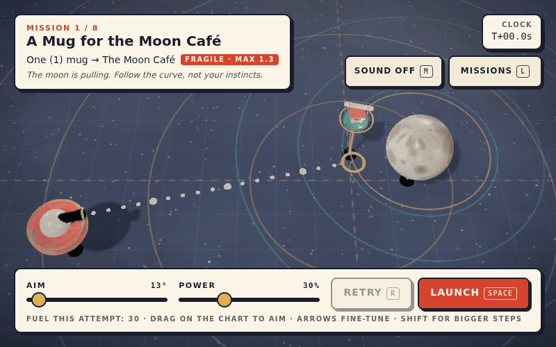
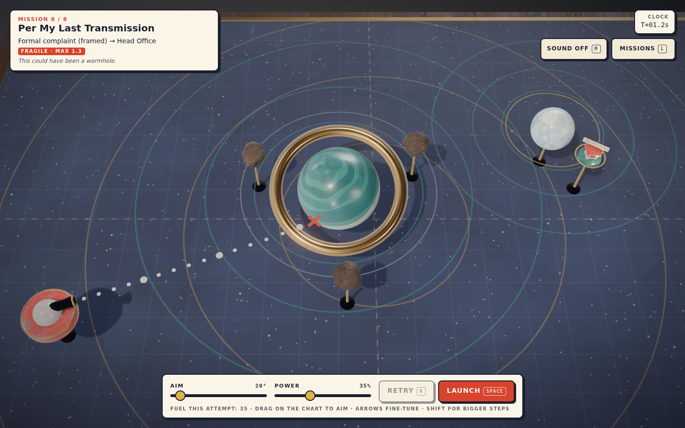
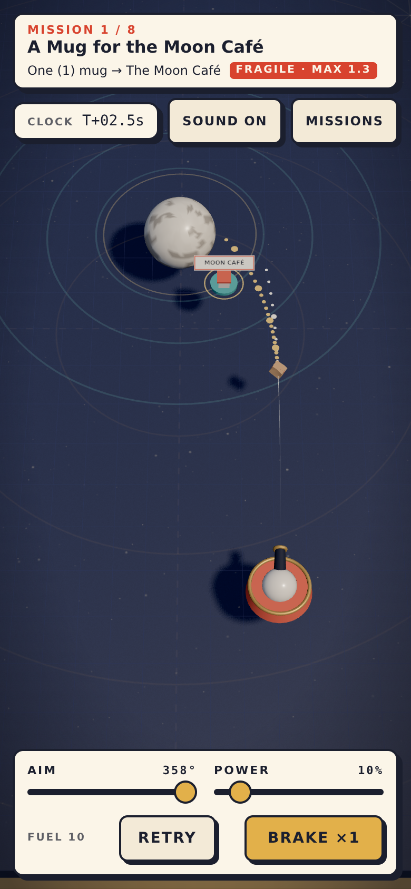

<p align="center">
  <a href="https://04-per-my-last-transmission.williamking.workers.dev"></a>
</p>

<p align="center">
  <a href="https://04-per-my-last-transmission.williamking.workers.dev"></a>
  <a href="https://threejs.org"></a>
  <a href="https://www.typescriptlang.org"></a>
  <a href="https://react.dev"></a>
  <a href="https://vite.dev"></a>
  <a href="https://bun.sh"></a>
  <a href="https://tailwindcss.com"></a>
  <a href="https://gsap.com"></a>
</p>

<p align="center"><strong>Fling fragile parcels through tiny, moving gravity wells for an interplanetary postal service that insists the planets moving is not its problem.</strong></p>

<p align="center">
  <a href="https://04-per-my-last-transmission.williamking.workers.dev"></a>
</p>

## How to play

Aim the depot cannon so gravity bends the parcel into the receiving dock as it swings past on its orbit, then arrive gently enough for the contents to survive. The dotted guide is honest: it is the real flight, simulated ahead of time.

| Action | Keyboard | Mouse / touch |
| --- | --- | --- |
| Aim | `←` `→` or `A` `D` (hold `Shift` for 5° steps) | Drag on the chart away from the cannon: direction is angle |
| Power | `↑` `↓` or `W` `S` | Drag distance, or the **Power** slider |
| Launch (timing matters: the planets keep moving) | `Space` or `Enter` | **Launch** |
| Brake, once per flight (the brass dots preview it) | `B` or `Space` | **Brake ×1** |
| Retry, instantly, even mid-flight | `R` | **Retry** |
| Next parcel after a delivery | `N` or `Enter` | **Next parcel** |
| Mission manifest | `L` (`Esc` closes) | **Missions** |
| Mute (remembered) | `M` | **Sound** |

Each mission earns up to three stamps: **Delivered**, **Gentle** (contents intact: under half the arrival limit) and **Frugal** (fuel within budget).

## What's inside

- **Eight authored missions**, each adding one idea: a single moon, a robust parcel, a fast dock, debris, a second gravity well, a dock on a moving moon, a ricochet, then everything at once.
- **Two parcel behaviours.** Fragile parcels need a gentle arrival and shatter on debris; robust ones shrug off a harder landing and ricochet off debris.
- **One brake, no second chances.** A brake ghost shows exactly where pulling it now would take you.
- **Your last attempt stays on the chart** as a red dashed route, with a ring showing where the dock was at your closest pass, so you learn instead of guess.
- **Dry parcel-service humour.** "Just circling back." "Arrived with excessive enthusiasm." "This could have been a wormhole."
- **Sound design:** elevator hold music while you aim, a space bed in flight, and a thunk, whoosh or smash for everything that happens.
- **Accessible by default:** keyboard, mouse and touch; labelled controls with visible focus; `prefers-reduced-motion` honoured throughout.

<table>
  <tr>
    <td width="72%"></td>
    <td width="28%"></td>
  </tr>
  <tr>
    <td align="center"><sub>Desktop, 1440×900</sub></td>
    <td align="center"><sub>Phone, 390×844</sub></td>
  </tr>
</table>

## Built with

Three.js 0.186 (no React Three Fiber) · TypeScript (strict) · React 19 for the HUD · Vite · Bun · Tailwind CSS v4 · GSAP · Biome · Playwright

- **Deterministic orbital flight.** Planets, moons and docks ride analytic orbits. The parcel is integrated at a fixed 120 Hz step, and the world clock counts whole ticks, so the same inputs always produce the same flight. Retry restarts the clock, which makes every attempt reproducible.
- **Honest path prediction.** The guide, the brake ghost and the real flight all call the same `step()` function. A unit test asserts that the prediction matches the flight to the bit.
- **Solver-verified missions.** `scripts/solve.ts` grid-searches launch timing, angle, power and brake moment for each mission. Every mission ships with a reference route that the tests fly, and an end-to-end Playwright test delivers mission 1 through the real UI.
- **Procedural miniature.** Every planet, cannon, parcel and café is built in code: enamel clearcoat materials, AgX tone mapping, one key light and a hemisphere light.

## Run it locally

```sh
bun install
bun run dev        # http://127.0.0.1:4514/
bun run check      # strict tsc, Biome, unit tests, production build into dist/
```

Extras: `bun run test:e2e` (Playwright on the production build), `bun scripts/solve.ts [missionId]` (route finder) and `bun scripts/capture-readme.ts` (regenerates the README media; needs `ffmpeg`).

Code map: `src/game/` pure rules and state (tested) · `src/scene/` three.js miniature · `src/audio/` sound manifest and Web Audio engine · `src/ui/` React HUD · `src/main.tsx` wiring.

## Credits

All geometry, textures, graphics and README art are generated procedurally in code or hand-written SVG. Type uses the system font stack.

### Audio

All audio is in `public/audio/`, re-encoded to MP3 (about 2.5 MB in total). Every file is CC0 (public domain dedication: https://creativecommons.org/publicdomain/zero/1.0/), so attribution is not required but is given here.

| File(s) | Source | Author | Licence |
| --- | --- | --- | --- |
| `music-hold.mp3` ("Elevator Music") | https://opengameart.org/content/elevator-music | Pro Sensory | CC0 |
| `ambience-space.mp3` ("Observing The Star", from "Another space background track") | https://opengameart.org/content/another-space-background-track | yd | CC0 |
| `launch-whoosh`, `flight-hum`, `crashed` | Sci-fi Sounds, https://kenney.nl/assets/sci-fi-sounds | Kenney | CC0 |
| `launch-clunk`, `bounce`, `stamp`, `rejected` | Impact Sounds, https://kenney.nl/assets/impact-sounds | Kenney | CC0 |
| `ui-click`, `ui-tick`, `ui-open`, `ui-close`, `ui-toggle`, `ui-retry`, `ui-next`, `circled` | Interface Sounds, https://kenney.nl/assets/interface-sounds | Kenney | CC0 |
| `brake`, `lost` | Digital Audio, https://kenney.nl/assets/digital-audio | Kenney | CC0 |
| `delivered`, `ending` | Music Jingles, https://kenney.nl/assets/music-jingles | Kenney | CC0 |

The original file names are `ElevatorMusic.wav`, `ObservingTheStar.ogg`, `thrusterFire_000`, `spaceEngineLow_000`, `explosionCrunch_000`, `impactMetal_heavy_000`, `impactPlate_medium_000`, `impactWood_heavy_001`, `impactGlass_heavy_002`, `click_002`, `tick_002`, `open_001`, `close_001`, `switch_002`, `back_001`, `confirmation_001`, `question_001`, `phaserDown2`, `lowDown`, `jingles_STEEL00` and `jingles_SAX03`. Kenney's licence text is CC0 in each pack's `License.txt`. The OpenGameArt licences were read from each page's licence field.

---

<p align="center"><sub>Part of William King's portfolio collection.</sub></p>
